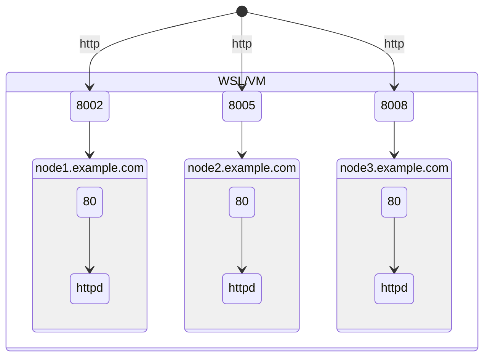

# Local Demo Environment

You can also do all exercises in a *local* development environment, if no Red Hat Demo environment is available. All you need is a Linxu VM or WSL instance with internet access, your development environment must meet the following requirements.

* Python 3.9+ (if you want to use the `ansible-navigator` Python 3.10+ is required!)

The demo environment will *mimic* the Red Hat Demo Environment with three managed nodes: **node1**, **node2** and **node3**. The Ansible control node (your VM) will be known as **ansible-1** in the lab inventory. Instead of virtual machines, *Podman* containers are used as the *managed nodes*.  

## Lab Diagram

The Lab environment consist of an *Ansible control node* (called `ansible-1`, your actual VM) and three *Managed nodes* (called `node1`, `node2` and `node3`, these are all containers). All managed nodes are Rocky8 hosts and are reachable password-less with SSH.



Although containers are used, all managed nodes are accessible via SSH, a couple of ports are exposed with every container:

| Managed node | Port 80 | Port 8080 |
| ------------ | ------- | --------- |
| node1        | 8002    | 8003      |
| node2        | 8005    | 8006      |
| node3        | 8008    | 8009      |

For example, if you want to access a webserver running on port 80 on node2 (this is one of the exercises), you'll need to access it via `http://localhost:8005` (instead of `localhost` you may need to use the IP or hostname of your VM).

> NOTE: If any ports in the range of 8001 to 8009 are already occupied, deployment will fail! You can adjust the ports to be used in the `inventory.ini`

## Prerequisites

You'll need Ansible to deploy the Workshop environment, install it with the following command:

```console
pip3 install ansible-core==2.16.8
```

??? question "Why not use the latest version?"
    *ansible-core 2.17+* only supports Python 3.7+ for target executions!  
    With many older distributions, the default Python version is Python3.6 or even older (as for RHEL8 or Rocky8 it is `/usr/libexec/platform-python`, which is Python3.6).  
    With 2.17+, the decision was made to not support such old Python versions anymore (which is understandable as in currently Q3 2024, even Python 3.7 is already EOL), but this obviously has implications on automating older distributions.  
    **For now, use the *older* 2.16.x (or *ansible 9* if you installed the complete package), as this is *supported*/tested until 2025.**

The playbook for deploying the Workshop environment is hosted in Gihub, you'll need the *Git* client to clone the project. In most Linux distributions, the Git client is already installed, otherwise install it with the following command, here for a Debian/Ubuntu distribution:

```console
sudo apt install git
```

To make sure your WSL distribution can start services in the managed node containers, run the following command:

```console
sudo apt install dbus-user-session
```

??? note
    Without this, you may encounter an error with `Failed to connect to bus: No such file or directory`.

It may be necessary to restart your WSL distribution (open Powershell and run `wsl --terminate`).

## Deployment

The deployment of the demo environment is automated, we will use Ansible to deploy the Ansible development/learning environment!

Clone the project from Github:

```console
git clone https://github.com/TimGrt/Workshop-Environment.git
```

Change into the directory:

```console
cd Workshop-Environment
```

Install the necessary requirements for Ansible with the following command:

```console
ansible-galaxy collection install -r requirements.yml
```

To create the managed node containers, run the `create-workshop-environment` playbook:

```console
ansible-playbook create-workshop-environment.yml
```

In short, the playbook will do the following steps:

1. Install Podman (if necessary).
2. Pull a Docker image and start as many containers as are defined in the inventory.
3. Deploy the *Workshop inventory* (not the same as is used by this playbook!) to `~/lab_inventory/hosts`.
4. Add a block with SSH config to access the managed nodes to `~/.ssh/config`.
5. Deploy the Ansible configuration for the Workshop to `~/.ansible.cfg`.
6. Create a SSH keypair for the Workshop (`~/.ssh/ansible-workshop-environment` and `~/.ssh/ansible-workshop-environment.pub`).
7. Prepare all managed nodes.

For additional information, take a look at the [README in the Github project](https://github.com/TimGrt/Workshop-Environment){:target="_blank"}

### Manual adjustments

> As your local `/etc/hosts` may include multiple personal adjustments the playbook won't change this file!

If you want to resolve the hosts (containers) with their hostname, adjust your `/etc/hosts`:

```ini
127.0.0.1 localhost node1 node2 node3
```

You still need to add the port, but now you can run `curl http://node1:8002`.

The SSH port for every container is also exposed via a high port (*node1* on *8001*, *node2* on *8004* and *node3* on *8007*), but you can access the managed nodes container like this:

```console
ssh node1
```

> NOTE: First login might take a while, subsequent logins will be faster!

## Delete Workshop environment

After completing the workshop, you can remove all traces of the demo environment by running the `delete-workshop-environment` playbook:

```console
ansible-playbook delete-workshop-environment.yml
```

The playbook will do the following steps:

1. Delete the managed node containers.
2. Delete the folder with the workshop inventory (`~/lab_inventory/hosts`).
3. Remove the managed nodes from `~/.ssh/known_hosts` if they were accessed manually.
4. Delete the block from `~/.ssh/config` which was added for the workshop.
5. Delete the Ansible configuration from `~/.ansible.cfg`, if a backup was created, a hint is shown.
6. Delete the keypair created for the workshop (`~/.ssh/ansible-workshop-environment` and `~/.ssh/ansible-workshop-environment.pub`).

If you want to delete the Podman installation as well, run the playbook like this:

```console
ansible-playbook delete-workshop-environment.yml -e delete_podman=true
```
